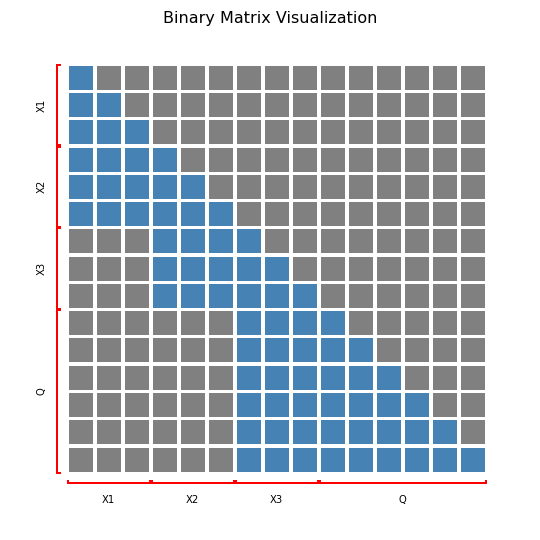

# LE-ATTENTION

> A-T-T-E-N-T-I-ON, attention is what I want
>
> ---NewJeans


LE-ATTENTION allows you to build (causal) attention matrix like LEGO blocks.
In particular, we assume that the context can be splited into chunks of text.
Each chunk is a *node* (named as an `ICLNode`), and other text chunks that contribute values
(i.e. text that this node can see) are the parents of this node.
As such, under the causal LLM setting, all nodes can form a DAG.

## Dependencies

Daft for DAG visualization (not implemented yet)
```
pip install daft
```

## Examples

It works like this

```python
from node import ICLNode, upstream_nodes, print_dag, build_attention_matrix, prepare_inputs
from viz_utils import visualize_attention_matrix
from transformers import AutoModelForCausalLM, AutoTokenizer

model_id = "meta-llama/Meta-Llama-3-8B-Instruct"
tokenizer = AutoTokenizer.from_pretrained(model_id)

X1 = ICLNode('example1.', id='X1')
X2 = ICLNode('example2.', parents=[X1], id='X2')
X3 = ICLNode('example3.', parents=[X2], id='X3')
Q = ICLNode('What does the fox say?', parents=[X3], id='Q')

print(print_dag(Q, output_character_limit=100))
>>> 
└── Q
    └── X3
        └── X2
            └── X1

attention_mask, all_nodes, start_end_pos, names = build_attention_matrix(Q, tokenizer)
print(attention_mask)
>>>
[[1 0 0 0 0 0 0 0 0 0 0 0 0 0 0 0]
 [1 1 0 0 0 0 0 0 0 0 0 0 0 0 0 0]
 [1 1 1 0 0 0 0 0 0 0 0 0 0 0 0 0]
 [1 1 1 1 0 0 0 0 0 0 0 0 0 0 0 0]
 [1 1 1 1 1 0 0 0 0 0 0 0 0 0 0 0]
 [1 1 1 1 1 1 0 0 0 0 0 0 0 0 0 0]
 [0 0 0 1 1 1 1 0 0 0 0 0 0 0 0 0]
 [0 0 0 1 1 1 1 1 0 0 0 0 0 0 0 0]
 [0 0 0 1 1 1 1 1 1 0 0 0 0 0 0 0]
 [0 0 0 0 0 0 1 1 1 1 0 0 0 0 0 0]
 [0 0 0 0 0 0 1 1 1 1 1 0 0 0 0 0]
 [0 0 0 0 0 0 1 1 1 1 1 1 0 0 0 0]
 [0 0 0 0 0 0 1 1 1 1 1 1 1 0 0 0]
 [0 0 0 0 0 0 1 1 1 1 1 1 1 1 0 0]
 [0 0 0 0 0 0 1 1 1 1 1 1 1 1 1 0]
 [0 0 0 0 0 0 1 1 1 1 1 1 1 1 1 1]]
```

Then if you call
```python
visualize_attention_matrix(attention_mask, start_end_pos, names, size_ratio=0.5,
                          save_dir='./figures/mask.png')
```
you get a visualization of the mask, where gray areas denote masked areas,
x-axis denotes the keys and y-axis denotes the queries.


Lastly, you can acquire the `input_ids` of all nodes under top-to-bottom topological order via
```python
input_ids, _ = prepare_inputs(nodes)
print(input_ids)
>>>
tensor([[ 8858,    16,    13,  8858,    17,    13,  8858,    18,    13,  3923,
          1587,   279, 39935,  2019,    30]])

for node in [X1, X2, X3, Q]:
    print(node.tokenize(tokenizer))
tensor([8858,   16,   13])
tensor([8858,   17,   13])
tensor([8858,   18,   13])
tensor([ 3923,  1587,   279, 39935,  2019,    30])
>>>
```
which, combined with the attention mask, can be fed into transformer's `generate` and `forward` function.

Notice that if you can also manually specify a text chunk's position id by setting `start_pos_id` or `end_pos_id`.

See `demo.ipynb` for more interesting attention matricies !!!!

## Acceleration with flex attention

Notice that, through the DAG language, we create a highly structured and sparse attention matrix, however default SDAP attention would NOT take into account the sparsity.
Fortunately, we have PyTorch's latest functionality `flex_attention`, which can be combined with LE-ATTENTION to actually make use of the structured attention and make THINGS faster,
see `flex_attention_experiments.ipynb` for examples.

## Important notes

1. "Begin of sentence" token is removed from the `token_ids` by default, you should manually add a node that represents the begin of sentence.
